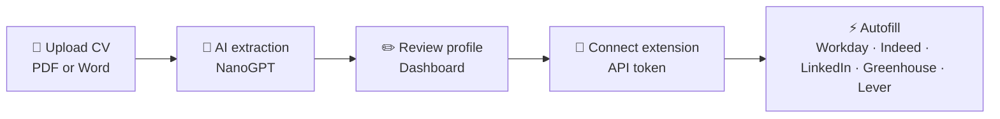

<p align="center">
  
</p>

<h1 align="center">AutoCVApply</h1>

<p align="center">
  <strong>Upload once. Apply everywhere.</strong><br />
  Stop retyping your life story into every job form.
</p>

<p align="center">
  <a href="https://autocvapply.com">Website</a> ·
  <a href="https://github.com/tmwclaxton/autoapplycv">GitHub</a> ·
  <a href="https://autocvapply.com/how-to">How it works</a>
</p>

<p align="center">
  
  
  
  
  
</p>

---

## The problem

Job applications are a copy-paste endurance test. Workday wants your address. Indeed wants it again. LinkedIn wants it in a different field order. Greenhouse wants a cover letter you've already written three times this week.

**AutoCVApply** reads your CV once, builds a structured profile, and stamps it onto application forms through a browser extension — so you spend time on roles that matter, not on retyping your phone number for the forty-seventh time.

## How it works



| Step | What happens |
|------|----------------|
| **1. Post your CV** | Drop a PDF or DOCX. We extract name, contact, skills, experience, and education. |
| **2. Check the details** | Tweak anything we missed — summary, extra context, visa status, salary expectations. |
| **3. Stamp the forms** | Install the Chrome extension, paste your API token, and autofill on supported job sites. |

## Features

### 🗂️ Smart CV parsing
Upload PDF or Word documents. AI pulls structured data into an editable profile you control.

### ⚡ One-click autofill
A Manifest V3 Chrome extension detects application forms and fills them from your profile — including longer free-text fields via your saved context.

### 🎯 Supported platforms
Autofill works on the boards that actually hire:

`Workday` · `Indeed` · `LinkedIn` · `Greenhouse` · `Lever`

### 📬 Postbox design
British utilitarian UI — Royal Mail red, navy, warm paper tones. Built to feel like sending a letter, not filling in a spreadsheet.

### 💳 Pricing

AutoCVApply is **free during early access**. CV parsing, profile editing, and unlimited extension autofill are all included.

A **Pro** plan (£7/mo) is planned for future features like multiple CV profiles — not for basic parsing or autofill.

> A fair-use upload limit applies behind the scenes to prevent abuse. Normal job seekers will never hit it.

## Tech stack

| Layer | Technology |
|-------|------------|
| Backend | Laravel 13, PHP 8.5 |
| Frontend | Inertia v3, Vue 3, Tailwind CSS v4 |
| Auth | WorkOS (web), Laravel Sanctum (extension API) |
| AI | NanoGPT (`gpt-4.1-mini`) for CV extraction |
| Payments | GoCardless (UK Direct Debit subscriptions) |
| Extension | Chrome MV3 — content scripts + service worker |
| Routing | Laravel Wayfinder (typed TS route helpers) |

## Project structure

```
autocvapply/
├── app/
│   ├── Http/Controllers/     # Web + API + billing + webhooks
│   ├── Models/               # User, CvProfile, CvUpload
│   └── Services/             # CV parser, NanoGPT, AI tokens, GoCardless
├── extension/
│   ├── src/                  # Popup, content script, background worker
│   └── dist/                 # Built extension (load unpacked)
├── resources/js/
│   ├── pages/                # Inertia pages (Welcome, Dashboard, Billing…)
│   └── components/postbox/   # Shared Postbox UI components
├── config/subscriptions.php  # Plan tiers and token limits
└── tests/                    # PHPUnit feature + unit tests
```

## Getting started

### Prerequisites

- PHP 8.5+, Composer
- Node.js 20+, npm
- PostgreSQL (or SQLite for quick local dev)

### Install

```bash
git clone https://github.com/tmwclaxton/autoapplycv.git
cd autoapplycv

cp .env.example .env
composer install
npm install

php artisan key:generate
php artisan migrate
npm run build
```

Or use the one-shot setup:

```bash
composer run setup
```

### Environment

Copy `.env.example` to `.env` and configure:

```env
APP_URL=http://localhost

# WorkOS — required for login
WORKOS_CLIENT_ID=
WORKOS_API_KEY=
WORKOS_REDIRECT_URL="${APP_URL}/authenticate"

# NanoGPT — required for CV parsing
NANOGPT_API_KEY=

# GoCardless — optional, for paid subscriptions
GOCARDLESS_ACCESS_TOKEN=
GOCARDLESS_WEBHOOK_SECRET=
```

### Run locally

```bash
composer run dev
```

This starts the Laravel server, queue worker, log tail, and Vite dev server together.

With Docker Sail:

```bash
./vendor/bin/sail up -d
./vendor/bin/sail npm run dev
```

Visit [http://localhost](http://localhost).

### Build the browser extension

```bash
npm run build:extension
```

Then in Chrome:

1. Open `chrome://extensions`
2. Enable **Developer mode**
3. Click **Load unpacked**
4. Select the `extension/dist/` folder

Generate an API token from the dashboard and paste it into the extension popup.

## API

The extension authenticates with Laravel Sanctum bearer tokens.

| Method | Endpoint | Description |
|--------|----------|-------------|
| `GET` | `/api/profile` | Fetch user profile + subscription usage |
| `POST` | `/api/tokens` | Generate a new extension token |
| `DELETE` | `/api/tokens/{token}` | Revoke a token |

## Testing

```bash
# Full suite
composer test

# Specific file
php artisan test --compact tests/Feature/OnboardingTest.php
```

CI runs on every push to `main` via GitHub Actions.

## Deployment

Production runs in Docker (`compose.prod.yaml`) with Nginx, PHP-FPM, and a queue worker. Pushes to `main` trigger the deploy workflow.

Live site: **[autocvapply.com](https://autocvapply.com)**

## Contributing

Issues and pull requests welcome on [GitHub](https://github.com/tmwclaxton/autoapplycv).

1. Fork the repo
2. Create a feature branch
3. Write tests for your changes
4. Run `composer test` and `npm run lint:check`
5. Open a PR

## License

MIT — use it, fork it, ship it.

---

<p align="center">
  <sub>Built for people who'd rather apply to jobs than retype their CV.</sub>
</p>
