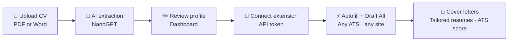
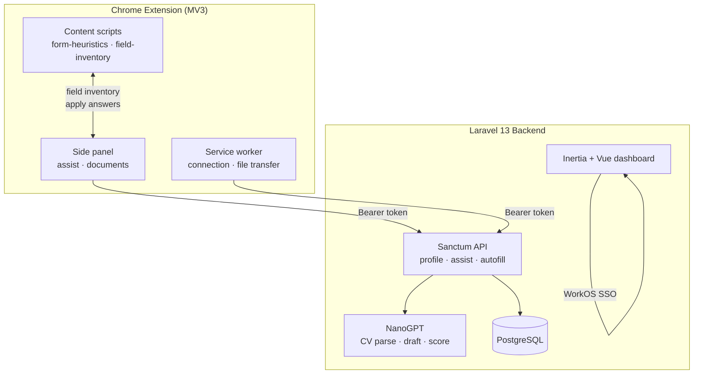
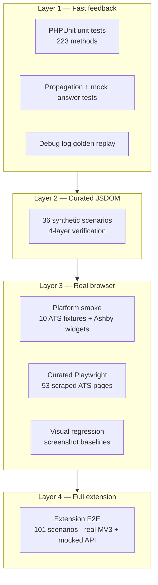

<p align="center">
  
</p>

<h1 align="center">AutoCVApply</h1>

<p align="center">
  <strong>Upload once. Apply everywhere.</strong><br />
  Stop retyping your life story into every job form.
</p>

<p align="center">
  <a href="https://autocvapply.com">Website</a> ·
  <a href="https://github.com/tmwclaxton/autoapplycv">GitHub</a> ·
  <a href="https://autocvapply.com/how-to">How it works</a>
</p>

<p align="center">
  
  
  
  
  
  
  
</p>

---

## The problem

Job applications are a copy-paste endurance test. Workday wants your address. Greenhouse wants it again. Ashby wants a cover letter you've already written three times this week. Every ATS renders the same questions differently — custom widgets, shadow DOM, multi-step wizards, iframe embeds.

**AutoCVApply** reads your CV once, builds a structured profile, and stamps it onto application forms through a battle-tested Chrome extension — so you spend time on roles that matter, not on retyping your phone number for the forty-seventh time.

## How it works



| Step | What happens |
|------|--------------|
| **1. Post your CV** | Drop a PDF or DOCX. Tesseract OCR + NanoGPT extract name, contact, skills, experience, and education into a structured profile. |
| **2. Check the details** | Tweak anything we missed — summary, visa status, salary expectations, application preferences. |
| **3. Connect the extension** | Install the Chrome extension, paste your connection JSON (`token` + `api_base`) from the dashboard. |
| **4. Fill and draft** | Autofill fields on any job form. **Draft All** streams AI-written answers for free-text questions, cover letters, and tailored resumes. |

## Features

### Smart CV parsing
Upload PDF or Word documents. NanoGPT pulls structured data into an editable profile you control — with Tesseract OCR for scanned documents and local `pdftoppm` preprocessing before any vision fallback.

### One-click autofill
A Manifest V3 Chrome extension detects application forms across the web and fills them from your profile — including comboboxes, radio groups, multi-step wizards, shadow DOM, and iframe-embedded fields.

### Application assistant
The extension sidebar talks to a streaming Application Assistant API: field inventory, job context extraction, per-field drafting, **Draft All** (batch fill), cover letters, tailored resumes, and ATS scoring.

### Supported platforms
Autofill is verified against real and synthetic fixtures from the ATS platforms that actually hire:

`Ashby` · `Greenhouse` · `Lever` · `Workday` · `SmartRecruiters` · `Teamtailor` · `BambooHR` · `Trakstar` · `WordPress/WPForms`

The extension runs on `<all_urls>` — these platforms are where we invest the deepest test coverage, not where we stop.

### Postbox design
British utilitarian UI — Royal Mail red, navy, warm paper tones. Built to feel like sending a letter, not filling in a spreadsheet.

### Pricing

Plans are based on **extension autofill** allowance. CV upload and profile editing are free on every plan.

| Plan | Price | Autofills / month |
|------|-------|-------------------|
| **Free** | £0 | 250 |
| **Starter** | £7/mo | 2,500 |
| **Pro** | £17/mo | 15,000 |

> Each successfully filled form input uses one autofill. Allowances reset on the 1st of each month.

---

## Architecture



| Component | Role |
|-----------|------|
| `extension/src/content/` | DOM heuristics, field inventory, iframe traversal, portal bar |
| `extension/src/sidepanel/` | Connection setup, Draft All UI, document uploads |
| `app/Services/ApplicationAssistantService.php` | Inventory, job context, streaming draft-all, cover letters |
| `app/Services/CvParserService.php` | PDF/Word ingestion, OCR, NanoGPT structured extraction |
| `scripts/form-corpus/` | Synthetic corpus generation, fill verification pyramid, E2E harness |

---

## Battle-tested quality engineering

> **This is not a side-project extension with a handful of smoke tests.** AutoCVApply ships with one of the most exhaustive form-autofill verification pipelines in the job-application tooling space — built because a single missed combobox on a Greenhouse form is a failed application.

### The numbers

| Metric | Count | Source |
|--------|------:|--------|
| Form extraction scenarios | **1,850** | `tests/fixtures/form-extraction/manifest.json` |
| Vetted scenarios | **1,846** | same manifest (`status: vetted`) |
| HTML fixtures + expected snapshots | **1,850 each** | `tests/fixtures/form-extraction/html/` · `expected/` |
| Curated fill-verify scenarios | **89** | `tests/fixtures/form-extraction/fill-verify-curated.json` |
| Platform smoke scenarios | **10** (+ 2 Ashby widget checks) | `fill-verify-smoke.json` · `run-ashby-*-playwright.mjs` |
| Extension E2E scenarios | **101** (10 in CI) | `tests/fixtures/extension-e2e/e2e-scenarios.json` |
| PHPUnit test methods | **223** | `tests/**/*Test.php` |
| ATS platforms in curated tier | **13** | `scripts/form-corpus/lib/curated-manifest.mjs` |

The corpus blends **544 scraped real ATS pages** (via Firecrawl) with **1,306 synthetic scenarios** — including framework-specific mega-forms for React, Vue, Angular, Svelte, Shadow DOM, Workday wizards, conditional fields, and combobox edge cases.

### The test pyramid

Every change to `form-heuristics.js` or `field-inventory.js` must survive the full pyramid before merge:



| Tier | Engine | Scope | CI job |
|------|--------|-------|--------|
| **Unit** | JSDOM / Node | Propagation, mock answers, debug-log replay | `php-tests` |
| **Form extraction eval** | JSDOM | All 1,846 vetted scenarios vs expected field inventory | `php-tests` |
| **Curated JSDOM** | JSDOM | 36 synthetic scenarios, 4-layer checks | `extension-fill` |
| **Platform smoke** | Playwright | 1 scenario per ATS/platform + Ashby yes/no + checkbox | `extension-fill` |
| **Curated Playwright** | Playwright | 53 priority scraped ATS fixtures | manual / nightly |
| **Visual regression** | Playwright + pixelmatch | Baseline compare on smoke subset | `extension-fill` |
| **Extension E2E** | Playwright + unpacked MV3 | Full Draft All with mocked assist API | `extension-fill` (optional) |

### Four layers of fill verification

Each curated JSDOM scenario passes **four independent checks** — not just "did we set a value?":

| Layer | What it proves |
|-------|----------------|
| **DOM readback** | Re-reads filled values from the DOM after `applyAnswerByRefAllFrames` |
| **HTML5 validity** | `element.checkValidity()` / `form.checkValidity()` on native controls |
| **Accessibility state** | `aria-checked`, `aria-selected`, `aria-pressed`, combobox collapsed state |
| **Error banners** | Ashby/Greenhouse-style validation messages, `[role="alert"]`, `[aria-invalid="true"]` |

Additional tiers add **OCR readback** (Playwright + Tesseract on Ashby fixtures), **pixel diff** (before/after screenshot % change), and **debug log golden replay** (extension phase summaries).

### Pass-rate thresholds (enforced in CI)

| Tier | Critical | Overall |
|------|----------|---------|
| JSDOM curated | 100% | 100% |
| Playwright priority | 100% | 100% |
| Platform smoke | 100% | 100% |
| Extension E2E | 100% | 100% |

### CI pipeline

Three GitHub Actions workflows guard every push to `main` and `develop`:

| Workflow | What runs |
|----------|-----------|
| **`tests.yml` → `php-tests`** | Laravel suite on PostgreSQL 17 — excludes `@group playwright` and `@group extension-e2e` |
| **`tests.yml` → `extension-fill`** | `npm run build:extension` → curated JSDOM verify → Playwright smoke + visual regression → optional extension E2E |
| **`lint.yml`** | Laravel Pint, ESLint, Prettier |
| **`prod_deploy.yml`** | Docker build → GHCR push → deploy to production on `main` |

After changing form heuristics locally, run the smoke tier before opening a PR:

```bash
npm run form-corpus:fill-verify:smoke
# or
FORM_CORPUS_PLAYWRIGHT=1 php artisan test --compact --filter=test_platform_smoke_playwright_passes
```

See [`scripts/form-corpus/README.md`](scripts/form-corpus/README.md) for the full maintenance workflow, report paths, and nightly tiers.

---

## Tech stack

| Layer | Technology |
|-------|------------|
| Backend | Laravel 13, PHP 8.5 |
| Frontend | Inertia v3, Vue 3, Tailwind CSS v4 |
| Auth | WorkOS (web), Laravel Sanctum (extension API) |
| AI | NanoGPT (`gpt-4.1-mini`) — CV extraction, drafting, ATS scoring |
| OCR | Tesseract + poppler (`pdftoppm`) locally; NanoGPT vision as fallback |
| Payments | GoCardless (UK Direct Debit subscriptions) |
| Extension | Chrome MV3 — content scripts, side panel, service worker |
| Fill verification | JSDOM, Playwright, pixelmatch, Tesseract.js |
| Routing | Laravel Wayfinder (typed TS route helpers) |

## Project structure

```
autocvapply/
├── app/
│   ├── Http/Controllers/       # Web + API + billing + webhooks
│   ├── Models/                 # User, CvProfile, CvUpload
│   └── Services/               # CV parser, Application Assistant, NanoGPT
├── extension/
│   ├── src/content/            # form-heuristics.js, field-inventory.js
│   ├── src/sidepanel/          # Connection, Draft All, documents
│   └── dist/                   # Built extension (load unpacked)
├── scripts/form-corpus/        # Corpus generation + fill verification pyramid
├── resources/js/
│   ├── pages/                  # Inertia pages (Welcome, Dashboard, Billing…)
│   └── components/postbox/     # Shared Postbox UI components
├── tests/
│   ├── Unit/Extension/         # 11 extension test suites (fill, E2E, extraction)
│   └── fixtures/
│       ├── form-extraction/    # 1,850-scenario corpus (html, expected, manifest)
│       └── extension-e2e/      # E2E mocks, scenarios, reports
└── config/subscriptions.php    # Plan tiers and token limits
```

## Getting started

### Prerequisites

- PHP 8.5+, Composer
- Node.js 20+, npm
- PostgreSQL (or SQLite for quick local dev)
- [Docker Sail](https://laravel.com/docs/sail) optional

### Install

```bash
git clone https://github.com/tmwclaxton/autoapplycv.git
cd autoapplycv

cp .env.example .env
composer install
npm install

php artisan key:generate
php artisan migrate
npm run build
```

Or use the one-shot setup:

```bash
composer run setup
```

### Environment

Copy `.env.example` to `.env` and configure:

```env
APP_URL=http://localhost

# WorkOS — required for login
WORKOS_CLIENT_ID=
WORKOS_API_KEY=
WORKOS_REDIRECT_URL="${APP_URL}/authenticate"

# NanoGPT — required for CV parsing
NANOGPT_API_KEY=

# GoCardless — optional, for paid subscriptions
GOCARDLESS_ACCESS_TOKEN=
GOCARDLESS_WEBHOOK_SECRET=
```

### Run locally

```bash
composer run dev
```

Starts the Laravel server, queue worker, log tail, and Vite dev server together.

With Docker Sail:

```bash
./vendor/bin/sail up -d
./vendor/bin/sail npm run dev
```

Visit [http://localhost](http://localhost).

### Build the browser extension

```bash
npm run build:extension
```

The build uses `APP_URL` from `.env` only to exclude your local dashboard from content-script injection. The extension API endpoint comes from the dashboard connection JSON (`token` + `api_base`).

Then in Chrome:

1. Open `chrome://extensions`
2. Enable **Developer mode**
3. Click **Load unpacked**
4. Select the `extension/dist/` folder

Generate a connection from the dashboard (**Copy** includes `token` + `api_base`) and paste it into the extension sidebar.

## Key commands

| Command | Purpose |
|---------|---------|
| `composer run dev` | Laravel + queue + Pail + Vite |
| `composer test` | Pint check + full PHPUnit suite |
| `npm run build:extension` | Build MV3 extension to `extension/dist/` |
| `npm run form-corpus:fill-verify:curated` | Curated JSDOM tier (CI default) |
| `npm run form-corpus:fill-verify:smoke` | Per-platform Playwright smoke |
| `npm run form-corpus:extension-e2e` | Extension E2E CI subset (~10 scenarios) |
| `npm run form-corpus:visual-regression` | Screenshot baseline compare |
| `npm run form-corpus:build-curated` | Regenerate curated + smoke manifests |
| `npm run lint:check` | ESLint |
| `composer lint:check` | Laravel Pint |

### PHPUnit tiers

```bash
# Default CI (excludes playwright + extension-e2e groups)
php artisan test --compact --exclude-group=extension-e2e,playwright

# Playwright smoke + visual regression
FORM_CORPUS_PLAYWRIGHT=1 php artisan test --compact --group=playwright

# Extension E2E CI subset
EXTENSION_E2E=1 php artisan test --compact --group=extension-e2e

# Full ~101 scenario extension E2E (nightly/manual, 30–60+ min)
EXTENSION_E2E=1 EXTENSION_E2E_FULL=1 php artisan test --compact --group=extension-e2e
```

## API

The extension authenticates with Laravel Sanctum bearer tokens.

| Method | Endpoint | Description |
|--------|----------|-------------|
| `GET` | `/api/profile` | Fetch user profile + subscription usage |
| `POST` | `/extension/connection` | Generate extension connection JSON (dashboard session) |
| `POST` | `/api/applications/assist/inventory` | Field inventory for current page |
| `POST` | `/api/applications/assist/job-context` | Extract job title, company, description |
| `POST` | `/api/applications/assist/draft-all` | Stream batch field answers (NDJSON) |
| `POST` | `/api/applications/assist/draft-field` | Single field draft |
| `POST` | `/api/applications/assist/cover-letter` | Generate cover letter |
| `POST` | `/api/applications/assist/tailored-resume` | Tailored resume draft |
| `DELETE` | `/api/tokens/{token}` | Revoke a token |

## Deployment

Production runs in Docker (`DockerfileProd`) with Nginx, PHP-FPM, and a queue worker. Pushes to `main` build a GHCR image and deploy via GitHub Actions.

Live site: **[autocvapply.com](https://autocvapply.com)**

## Contributing

Issues and pull requests welcome on [GitHub](https://github.com/tmwclaxton/autoapplycv).

1. Fork the repo
2. Create a feature branch
3. Write tests for your changes
4. If you touched `form-heuristics.js` or `field-inventory.js`, run `npm run form-corpus:fill-verify:smoke`
5. Run `composer test` and `npm run lint:check`
6. Open a PR

## License

MIT — use it, fork it, ship it.

---

<p align="center">
  <sub>Built for people who'd rather apply to jobs than retype their CV.<br />
  Verified against 1,850 form scenarios. Battle-tested on real ATS platforms.</sub>
</p>
