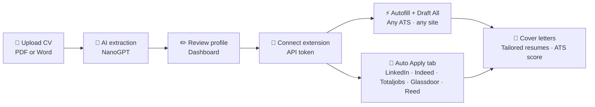
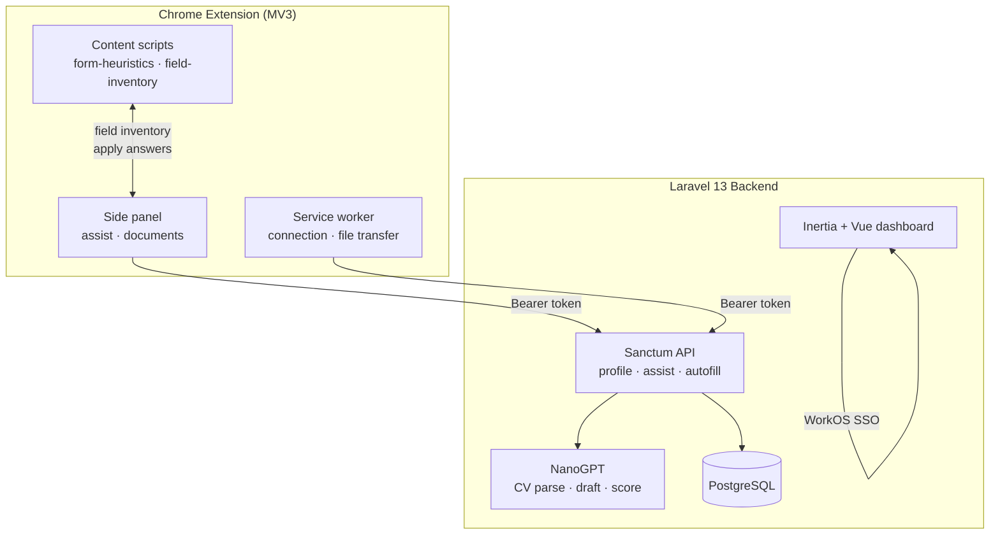
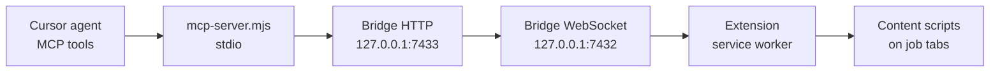
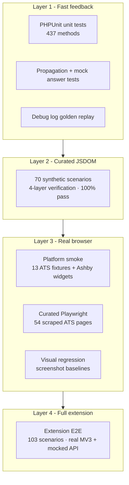
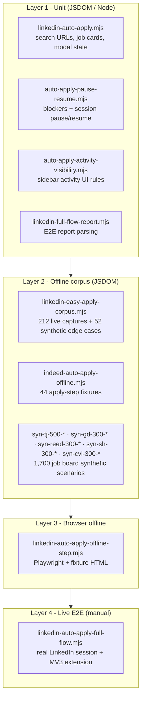

<p align="center">
  
</p>

<h1 align="center">AutoCVApply</h1>

<p align="center">
  <strong>Upload once. Apply everywhere.</strong><br />
  Stop retyping your life story into every job form.
</p>

<p align="center">
  <a href="https://autocvapply.com"></a>
  <a href="https://github.com/tmwclaxton/autoapplycv"></a>
</p>

<p align="center">
  <a href="https://autocvapply.com">Website</a> ·
  <a href="https://github.com/tmwclaxton/autoapplycv">GitHub</a> ·
  <a href="https://autocvapply.com/how-to">How it works</a> ·
  <a href="https://autocvapply.com/dashboard">Dashboard</a>
</p>

<p align="center">
  
  
  
  
  
  
  
</p>

<p align="center">
  <strong><a href="https://autocvapply.com">Sign up free at autocvapply.com</a></strong> - upload your CV, connect the extension, fill forms in minutes.<br />
  <sub><strong>Job board Auto Apply:</strong> LinkedIn, Indeed, Totaljobs, Glassdoor, and Reed - full end-to-end apply from the extension sidebar. On other ATS forms, you review every field and click Submit yourself.</sub>
</p>

---

## Table of contents

**Getting started**

- [See it in action](#see-it-in-action)
- [What is AutoCVApply?](#what-is-autocvapply)
- [Without vs with AutoCVApply](#without-vs-with-autocvapply)
- [Quick install](#quick-install)

**Using AutoCVApply**

- [How it works](#how-it-works)
- [Job board Auto Apply](#job-board-auto-apply)
- [Features](#features)
- [Cover letters](#cover-letters)
- [Supported platforms](#supported-platforms)
- [Postbox design](#postbox-design)
- [Pricing](#pricing)
- [Security & privacy](#security--privacy)
- [Testing overview](#testing-overview)
- [Job search tips](#job-search-tips)
- [Links](#links)

**For developers**

- [Architecture](#architecture)
- [Tech stack](#tech-stack)
- [Project structure](#project-structure)
- [Getting started (local dev)](#getting-started-local-dev)
- [Extension bridge (MCP)](#extension-bridge-mcp)
- [Form corpus quality engineering](#form-corpus-quality-engineering)
- [Job board Auto Apply testing](#job-board-auto-apply-testing)
- [Key commands](#key-commands)
- [API](#api)
- [Deployment](#deployment)
- [Contributing](#contributing)
- [License](#license)

---

## See it in action

<!-- TODO: replace with YouTube thumbnail + link once demo video is recorded -->
<!-- [](https://youtu.be/VIDEO_ID) -->

> **Demo video coming soon.** Until then, see [How it works on autocvapply.com](https://autocvapply.com/how-to) or sign up and try Draft All on a real Greenhouse or Ashby form.

---

## What is AutoCVApply?

Job applications are a copy-paste endurance test. Workday wants your address. Greenhouse wants it again. Ashby wants a cover letter you've already written three times this week. Every ATS renders the same questions differently - custom widgets, shadow DOM, multi-step wizards, iframe embeds.

**AutoCVApply** reads your CV once, builds a structured profile, and stamps it onto application forms through a battle-tested Chrome extension - so you spend time on roles that matter, not on retyping your phone number for the forty-seventh time.

## Without vs with AutoCVApply

| Without AutoCVApply | With AutoCVApply |
|---------------------|------------------|
| Retype contact details, education, and skills on every ATS | **One structured profile** - filled from your uploaded CV |
| Blank stare at "Why do you want this role?" textareas | **Draft All** streams AI answers for free-text questions |
| Skip cover letters because they're tedious | **One-click cover letter** tailored to the job description |
| Same generic CV for every posting | **Tailored resume draft** matched to the role |
| No idea how your CV reads against the JD | **ATS score** with keyword and formatting feedback |
| Pray comboboxes and wizards don't break mid-form | **6,229-scenario test corpus** - Greenhouse, Ashby, Workday, UK job boards, and more |
| Obvious bot-like paste fills that trip ATS checks | **Anti-bot detection** - character-by-character typing, natural pauses, human-like navigation on job board Auto Apply |
| Click through Easy Apply one job at a time | **Job board Auto Apply** - LinkedIn, Indeed, Totaljobs, Glassdoor, and Reed from the extension sidebar |
| Submit applications blindly | **You stay in control on ATS forms** - we fill fields; you review and submit |

> **Job board Auto Apply** (LinkedIn, Indeed, Totaljobs, Glassdoor, Reed) runs end-to-end: search filtered jobs, open each posting, fill every step, and submit. More boards are on the way.

## Who it's for

- **Job seekers** applying across multiple ATS platforms in a week
- **Career changers** who need tailored answers without rewriting everything
- **Privacy-conscious applicants** who want a clear account, revocable API tokens, and a published [privacy policy](https://autocvapply.com/privacy)
- **Developers and contributors** who care about verified form-fill quality, not just demo GIFs

**Why choose AutoCVApply?**

- **Save time** - autofill plus AI drafting for the questions that actually slow you down
- **Stay honest** - answers draw from your profile and preferences, not invented credentials
- **Sound human, not generic** - Draft All answers are scored on hundreds of scenarios to catch AI tropes, em dashes, and filler while staying grounded in your CV
- **Trust the engineering** - four-layer fill verification, Playwright smoke tests, and 437 PHPUnit methods
- **Avoid bot flags** - human-like typing, pauses between fields, and natural navigation on job board Auto Apply runs
- **British Postbox UI** - Royal Mail red, navy, warm paper tones. Feels like sending a letter, not filling a spreadsheet

## Quick install

> **Recommended:** create a free account at **[autocvapply.com](https://autocvapply.com)**, upload your CV, then download the extension from your dashboard. Chrome Web Store listing is not live yet - sideload via zip for now.

### Production (autocvapply.com)

1. **[Sign up](https://autocvapply.com)** and upload your CV
2. Open **Dashboard → Extension** and choose your browser
3. Download the zip (Chrome, Edge, Brave, or Firefox)
4. Sideload using the on-screen instructions
5. Copy your connection JSON (`token` + `api_base`) into the extension sidebar

| Browser | Install method | Store listing |
|---------|----------------|---------------|
| **Chrome / Edge / Brave** | Download zip from dashboard → Load unpacked | Chrome Web Store - *coming soon* |
| **Firefox** | Download zip from dashboard → Load Temporary Add-on | Firefox Add-ons - *coming soon* |

### From source (developers)

Clone this repo, run `composer run setup`, build the extension with `npm run build:extension`, then load `extension/dist/` unpacked in Chrome. See [Getting started (local dev)](#getting-started-local-dev) for full setup.

---

## How it works



| Step | What happens |
|------|--------------|
| **1. Post your CV** | Drop a PDF or DOCX. Tesseract OCR + NanoGPT extract name, contact, skills, experience, and education into a structured profile. |
| **2. Check the details** | Tweak anything we missed - summary, visa status, salary expectations, application preferences. |
| **3. Connect the extension** | Install the Chrome or Firefox extension, paste your connection JSON (`token` + `api_base`) from the dashboard. |
| **4. Fill and draft** | Autofill fields on any job form. **Draft All** streams AI-written answers for free-text questions, cover letters, and tailored resumes. **You submit when ready.** |
| **5. Auto Apply (job boards)** | Open the extension sidebar **Auto Apply** tab, pick LinkedIn, Indeed, Totaljobs, Glassdoor, or Reed, and let the extension search, open each job, fill every step, and submit. |

## Job board Auto Apply

Full end-to-end applications on **LinkedIn Easy Apply**, **Indeed Apply**, **Totaljobs Quick Apply**, **Glassdoor Easy Apply**, and **Reed Easy Apply** - not just field fill:

| Step | What happens |
|------|--------------|
| **Search** | Extension runs job search with Easy Apply filters from the sidebar **Auto Apply** tab |
| **Open** | Each matching job opens in a tab; listings without one-click apply are skipped |
| **Fill** | Contact info, screening questions, resume steps, and multi-step wizards are filled from your profile |
| **Submit** | Continue, review, and submit buttons advance and complete the application |

On Greenhouse, Ashby, Workday, and other ATS platforms, autofill and Draft All still work as before - **you review and click Submit yourself**. More full Auto Apply job boards are on the way.

## Features

| Module | Feature | What it does |
|--------|---------|--------------|
| **CV parsing** | PDF & Word upload | Structured profile extraction with Tesseract OCR + local `pdftoppm` preprocessing |
| **CV parsing** | Editable profile | Skills, experience, education, summary, application preferences - you control the source of truth |
| **Autofill** | One-click fill | Profile data stamped onto native inputs, comboboxes, radios, checkboxes, multi-step wizards |
| **Autofill** | Anti-bot detection | Character-by-character typing on short fields, pauses between applies, hover-and-click navigation on job board Auto Apply |
| **Autofill** | Shadow DOM & iframes | Content scripts traverse embedded ATS widgets other extensions miss |
| **Auto Apply** | LinkedIn Easy Apply E2E | Sidebar **Auto Apply** tab: search, open jobs, fill steps, submit applications |
| **Auto Apply** | Indeed Apply E2E | Indeed Apply search, contact/resume/questions/review steps, submit via **Auto Apply** tab |
| **Auto Apply** | Totaljobs Quick Apply E2E | Genesis Quick Apply search, fill, and submit from the sidebar |
| **Auto Apply** | Glassdoor Easy Apply E2E | Host-page search plus Indeed Apply iframe steps where required |
| **Auto Apply** | Reed Easy Apply E2E | Reed search, job detail, modal review, and submit |
| **Application Assistant** | Field inventory | AI maps the page's questions to fillable refs before drafting |
| **Application Assistant** | Job context | Extracts title, company, and description from the posting |
| **Application Assistant** | Draft All | Streams batch answers for unanswered fields (NDJSON) |
| **Application Assistant** | Draft field | Single-field AI answer on demand |
| **Application Assistant** | Answer quality | Rubric scoring on AI drafts - human tone, profile grounding, banned AI phrases, no em dashes |
| **Documents** | Cover letter | Styled, job-specific PDF from your profile + posting (extension Auto Apply + Cover tab) |
| **Documents** | Tailored resume | Role-matched resume draft |
| **Documents** | ATS score | Keyword and compatibility feedback against the job description |
| **Dashboard** | Cover letter settings | Design + font preferences (including Random) with live preview |
| **Dashboard** | Usage & billing | Monthly autofill allowance, extension connection, GoCardless subscriptions (UK) |
| **Analytics** | Public aggregate stats | Daily totals across all users - no personal application history exposed |

### Cover letters

AutoCVApply generates **styled cover letters** on the fly in the extension during Auto Apply and from the Cover tab. On the dashboard, open **Cover letter settings** to pick a design and font (or Random for either), preview the result live, and use those preferences whenever a letter is attached.

### Human-sounding AI drafts

Draft All and Quick Answer use AI, but we score generated answers extensively before shipping changes - not just on a handful of demo forms.

| What we check | Why it matters |
|---------------|----------------|
| **Grounding** | Real employers, roles, and skills from your profile - not invented credentials |
| **Human tone** | Banned AI phrases and overused words ("leverage", "proven track record", "I am thrilled to apply") |
| **Formatting** | No em dashes or markdown - plain text ready to paste into employer forms |
| **Honesty** | Gaps acknowledged instead of fabricated experience |

Scoring runs across **190** profile-mapping scenarios, **124** answer-quality scenarios, **150** real ATS form E2E scoring fixtures, and Assist sidebar test cases. Developer audit commands: `answer-quality:audit`, `assist-answer-quality:audit`, `form-e2e:score` (see [`scripts/extension-benchmark/README.md`](scripts/extension-benchmark/README.md)).

### Anti-bot detection

Job sites increasingly flag instant paste fills and robotic click patterns. AutoCVApply fills like a person where it matters:

| Behaviour | What it does |
|-----------|--------------|
| **Character-by-character typing** | Short text fields (names, emails, years, locations) type one keystroke at a time with realistic delays |
| **Paced batch apply** | Draft All fills one field at a time with scroll, focus, and pause between each |
| **Human-like job board navigation** | Smooth scroll, hover-before-click, and variable delays when opening apply flows and stepping through multi-page forms on LinkedIn, Indeed, Totaljobs, Glassdoor, and Reed |
| **Smart fallbacks** | Long free-text answers still paste instantly so multi-paragraph drafts do not take minutes |

## Supported platforms

<!-- readme-platforms:start -->
Autofill works on most major ATS and employer career sites. **Auto Apply** runs end-to-end from the extension sidebar on supported job boards (search, fill every step, submit). More boards across the UK, Ireland, US, Canada, Australia, and New Zealand are on the way.

### Autofill on ATS and career sites

<table><tr><td valign="top"><a href="https://www.workday.com"> Workday</a></td><td valign="top"><a href="https://www.greenhouse.io"> Greenhouse</a></td><td valign="top"><a href="https://www.lever.co"> Lever</a></td><td valign="top"><a href="https://www.ashbyhq.com"> Ashby</a></td></tr><tr><td valign="top"><a href="https://www.smartrecruiters.com"> SmartRecruiters</a></td><td valign="top"><a href="https://www.teamtailor.com"> Teamtailor</a></td><td valign="top"><a href="https://www.oracle.com/applications/human-capital-management/talent-management/recruiting/"> Oracle</a></td><td valign="top"><a href="https://www.bamboohr.com"> BambooHR</a></td></tr><tr><td valign="top"><a href="https://www.workable.com"> Workable</a></td><td valign="top"><a href="https://www.icims.com"> iCIMS</a></td><td valign="top"><a href="https://www.trakstar.com"> Trakstar</a></td><td valign="top"><a href="https://wordpress.org/plugins/tags/job-board/"> WordPress</a></td></tr></table>

<sub>Plus many more employer career sites and ATS variants.</sub>

### Auto Apply - supported today

<table><tr><td valign="top"><a href="https://www.linkedin.com/jobs"> LinkedIn</a></td><td valign="top"><a href="https://www.indeed.com"> Indeed</a></td><td valign="top"><a href="https://www.totaljobs.com"> Totaljobs</a></td><td valign="top"><a href="https://www.glassdoor.com/Job/index.htm"> Glassdoor</a></td></tr><tr><td valign="top"><a href="https://www.simplyhired.com"> SimplyHired</a></td><td valign="top"><a href="https://www.reed.co.uk/jobs"> Reed</a></td><td valign="top"><a href="https://www.cv-library.co.uk"> CV-Library</a></td><td></td></tr></table>

Full end-to-end apply: search filtered jobs, open each posting, fill every step, and submit from the extension sidebar **Auto Apply** tab.

### Auto Apply - coming soon

<table><tr><td valign="top"><a href="https://www.adzuna.com"> Adzuna</a></td><td valign="top"><a href="https://www.apsjobs.gov.au"> APS Jobs</a></td><td valign="top"><a href="https://www.careerbuilder.com"> CareerBuilder</a></td><td valign="top"><a href="https://www.careerone.com.au"> CareerOne</a></td><td valign="top"><a href="https://www.civilservicejobs.service.gov.uk"> Civil Service Jobs</a></td></tr><tr><td valign="top"><a href="https://www.dice.com"> Dice</a></td><td valign="top"><a href="https://www.eluta.ca"> Eluta</a></td><td valign="top"><a href="https://www.ethicaljobs.com.au"> EthicalJobs</a></td><td valign="top"><a href="https://findajob.dwp.gov.uk"> Find a Job</a></td><td valign="top"><a href="https://www.flexjobs.com"> FlexJobs</a></td></tr><tr><td valign="top"><a href="https://www.governmentjobs.com"> Government Jobs</a></td><td valign="top"><a href="https://jobs.theguardian.com"> Guardian Jobs</a></td><td valign="top"><a href="https://www.idealist.org"> Idealist</a></td><td valign="top"><a href="https://www.irishjobs.ie"> IrishJobs.ie</a></td><td valign="top"><a href="https://www.jobbank.gc.ca"> Job Bank</a></td></tr><tr><td valign="top"><a href="https://www.jobs.ac.uk"> Jobs.ac.uk</a></td><td valign="top"><a href="https://www.jobsgopublic.com"> Jobs Go Public</a></td><td valign="top"><a href="https://www.jobsearch.gov.au"> JobSearch</a></td><td valign="top"><a href="https://www.jobs.ie"> Jobs.ie</a></td><td valign="top"><a href="https://www.jobsireland.ie"> JobsIreland</a></td></tr><tr><td valign="top"><a href="https://www.jobserve.com"> Jobserve</a></td><td valign="top"><a href="https://www.jobsdb.com"> JobsDB</a></td><td valign="top"><a href="https://www.jobstreet.com"> JobStreet</a></td><td valign="top"><a href="https://www.jobillico.com"> Jobillico</a></td><td valign="top"><a href="https://www.jora.com"> Jora</a></td></tr><tr><td valign="top"><a href="https://www.theladders.com"> Ladders</a></td><td valign="top"><a href="https://www.lgjobs.com"> LG Jobs</a></td><td valign="top"><a href="https://www.linkup.com"> LinkUp</a></td><td valign="top"><a href="https://www.monster.com"> Monster</a></td><td valign="top"><a href="https://www.jobs.nhs.uk"> NHS Jobs</a></td></tr><tr><td valign="top"><a href="https://www.jobs.govt.nz"> NZ Government Jobs</a></td><td valign="top"><a href="https://www.publicjobs.ie"> Publicjobs.ie</a></td><td valign="top"><a href="https://www.seek.com.au"> SEEK</a></td><td valign="top"><a href="https://www.snagajob.com"> Snagajob</a></td><td valign="top"><a href="https://www.trademe.co.nz/jobs"> Trade Me Jobs</a></td></tr><tr><td valign="top"><a href="https://www.usajobs.gov"> USAJobs</a></td><td valign="top"><a href="https://www.workopolis.com"> Workopolis</a></td><td valign="top"><a href="https://www.ziprecruiter.com"> ZipRecruiter</a></td><td></td><td></td></tr></table>

<sub>+ more boards across the Anglosphere.</sub>

> **Note:** On ATS forms (Greenhouse, Ashby, Workday, etc.) autofill and Draft All fill fields for you - **you review and click Submit yourself**. Job board Auto Apply completes submissions end-to-end on supported boards above.

<!-- readme-platforms:end -->

Regenerate this block after changing platform lists in `resources/js/lib/site.ts`:

```bash
npm run readme:platforms
```

This rewrites the block between `<!-- readme-platforms:start -->` and `<!-- readme-platforms:end -->` in this file.

### Fill verification depth (ATS)

| Platform | Coverage | Notes |
|----------|----------|-------|
| **Ashby** | Curated + smoke + widget checks | Yes/no and checkbox widget scenarios |
| **Greenhouse** | Curated + smoke | Scraped real boards in corpus |
| **Lever** | Curated + smoke | Multi-step apply flows |
| **Workday** | Curated + smoke | Wizard-style applications |
| **SmartRecruiters** | Curated + smoke | Long multi-section forms |
| **Teamtailor** | Curated + smoke | Nordic/EU hiring stacks |
| **BambooHR** | Curated tier | HR suite apply pages |
| **Trakstar** | Curated tier | Performance/hiring forms |
| **WordPress / WPForms** | Curated + smoke | Generic employer sites |
| **Any site** | Extension runs on `<all_urls>` | Deepest test coverage on ATS platforms above - not where we stop |

## Postbox design

British utilitarian UI - Royal Mail red, navy, warm paper tones. Built to feel like sending a letter, not filling in a spreadsheet.

## Pricing

Plans are based on **extension autofill** allowance. CV upload and profile editing are free on every plan.

| Plan | Price | Autofills / month |
|------|-------|-------------------|
| **Free** | £0 | 250 |
| **Starter** | £7/mo | 2,500 |
| **Pro** | £17/mo | 15,000 |

> Each successfully filled form input uses one autofill. Allowances reset on the 1st of each month.

## Security & privacy

- **Your profile, your account** - CV and structured profile data live on autocvapply.com under WorkOS authentication. You can delete your account from settings.
- **Extension fills locally** - the browser extension fetches your profile via a revocable Sanctum token and writes values into the page DOM. It does not send completed submissions back to us.
- **No data selling** - we do not sell personal data. See the full [privacy policy](https://autocvapply.com/privacy).
- **AI processing** - CV parsing and drafting send text to our NanoGPT provider as needed to extract fields or generate answers. Job context from the page may be included in draft requests.
- **Source available** - PolyForm Noncommercial-licensed core. Inspect the extension, backend, and 6,229-scenario test corpus on GitHub. Free for personal and non-commercial use; commercial use requires permission.
- **You submit on ATS forms** - autofill and Draft All never auto-click Submit on Greenhouse, Ashby, Workday, and similar sites. **Job board Auto Apply** (LinkedIn, Indeed, Totaljobs, Glassdoor, Reed) completes submissions end-to-end from the sidebar; more boards are on the way.

## Testing overview

AutoCVApply is verified by two complementary test pyramids - not a handful of smoke tests:

| Pyramid | Scope | Fast tier (CI on every push) |
|---------|-------|----------------------------|
| **ATS form corpus** | 6,229 extraction scenarios (3,942 vetted), 124 curated fill-verify cases, 13 platform smoke fixtures | Curated JSDOM (70) + Playwright smoke |
| **Job board Auto Apply** | 212 LinkedIn captures, 44 Indeed step fixtures, 1,700 synthetic job-board scenarios (Totaljobs, Glassdoor, Reed, SimplyHired, CV-Library), unit + offline corpus tests | Unit tests + offline corpus |

Both pyramids enforce **100% pass rates** on critical tiers before merge. Full tier breakdowns, commands, and fixture layout are in [Form corpus quality engineering](#form-corpus-quality-engineering) and [Job board Auto Apply testing](#job-board-auto-apply-testing) below.

## Job search tips

Practical advice for high-volume applications (no magic numbers - your mileage varies):

1. **Apply while the posting is fresh.** Early applicants often face less competition; automation helps you move faster without cutting corners on quality.
2. **Keep your master CV ATS-simple.** Single column, standard headings, no graphics in the parse path. Use AutoCVApply's ATS score against the job description before you submit.
3. **Tailor the narrative, not just keywords.** Draft All and cover letters work best when your profile summary and application preferences reflect what you actually want.
4. **Review every field.** We fill aggressively; you confirm accuracy - especially salary, visa, and eligibility questions.
5. **Track applications yourself for now.** Use your own spreadsheet or notes; a personal application tracker in the dashboard is on the roadmap.

## Links

| | |
|---|---|
| **Website** | [autocvapply.com](https://autocvapply.com) |
| **Dashboard** | [autocvapply.com/dashboard](https://autocvapply.com/dashboard) |
| **How it works** | [autocvapply.com/how-to](https://autocvapply.com/how-to) |
| **Analytics** | [autocvapply.com/analytics](https://autocvapply.com/analytics) |
| **Blog** | [autocvapply.com/blog](https://autocvapply.com/blog) |
| **Privacy** | [autocvapply.com/privacy](https://autocvapply.com/privacy) |
| **Contact** | [autocvapply.com/contact](https://autocvapply.com/contact) |
| **GitHub** | [github.com/tmwclaxton/autoapplycv](https://github.com/tmwclaxton/autoapplycv) |
| **Discord** | [discord.gg/DqqqTv3Spt](https://discord.gg/DqqqTv3Spt) - extension help & community |
| **Chrome Web Store** | *Listing not published yet - use dashboard zip download* |
| **Form corpus docs** | [`scripts/form-corpus/README.md`](scripts/form-corpus/README.md) |
| **Extension bridge (MCP)** | [`scripts/extension-bridge/README.md`](scripts/extension-bridge/README.md) |
| **Job board automation playbook** | [`docs/platform-automation-playbook.md`](docs/platform-automation-playbook.md) |

---

## Architecture



| Component | Role |
|-----------|------|
| `extension/src/content/` | DOM heuristics, field inventory, iframe traversal, portal bar |
| `extension/src/sidepanel/` | Connection setup, Draft All UI, document uploads |
| `app/Services/ApplicationAssistantService.php` | Inventory, job context, streaming draft-all, cover letters |
| `app/Services/CvParserService.php` | PDF/Word ingestion, OCR, NanoGPT structured extraction |
| `scripts/form-corpus/` | Synthetic corpus generation, fill verification pyramid, E2E harness |

## Tech stack

| Layer | Technology |
|-------|------------|
| Backend | Laravel 13, PHP 8.5 |
| Frontend | Inertia v3, Vue 3, Tailwind CSS v4 |
| Auth | WorkOS (web), Laravel Sanctum (extension API) |
| AI | NanoGPT (`gpt-4.1-mini`) - CV extraction, drafting, ATS scoring |
| OCR | Tesseract + poppler (`pdftoppm`) locally; NanoGPT vision as fallback |
| Payments | GoCardless (UK Direct Debit subscriptions) |
| Extension | Chrome MV3 - content scripts, side panel, service worker |
| Fill verification | JSDOM, Playwright, pixelmatch, Tesseract.js |
| Routing | Laravel Wayfinder (typed TS route helpers) |

## Project structure

```
autocvapply/
├── app/
│   ├── Http/Controllers/       # Web + API + billing + webhooks
│   ├── Models/                 # User, CvProfile, CvUpload
│   └── Services/               # CV parser, Application Assistant, NanoGPT
├── extension/
│   ├── src/content/            # form-heuristics.js, field-inventory.js
│   ├── src/sidepanel/          # Connection, Draft All, documents
│   └── dist/                   # Built extension (load unpacked)
├── scripts/form-corpus/        # Corpus generation + fill verification pyramid
├── scripts/extension-bridge/   # Localhost bridge + MCP server for agent-driven Chrome
├── resources/js/
│   ├── pages/                  # Inertia pages (Welcome, Dashboard, Billing…)
│   └── components/postbox/     # Shared Postbox UI components
├── tests/
│   ├── Unit/Extension/         # 11 extension test suites (fill, E2E, extraction)
│   └── fixtures/
│       ├── form-extraction/    # 6,229-scenario corpus (html, expected, manifest)
│       └── extension-e2e/      # E2E mocks, scenarios, reports
└── config/subscriptions.php    # Plan tiers and token limits
```

## Getting started (local dev)

### Prerequisites

- PHP 8.5+, Composer
- Node.js 20+, npm
- PostgreSQL (or SQLite for quick local dev)
- [Docker Sail](https://laravel.com/docs/sail) optional

### Install

```bash
git clone https://github.com/tmwclaxton/autoapplycv.git
cd autoapplycv

cp .env.example .env
composer install
npm install

php artisan key:generate
php artisan migrate
npm run build
```

Or use the one-shot setup:

```bash
composer run setup
```

### Environment

Copy `.env.example` to `.env` and configure:

```env
APP_URL=http://localhost

# WorkOS - required for login
WORKOS_CLIENT_ID=
WORKOS_API_KEY=
WORKOS_REDIRECT_URL="${APP_URL}/authenticate"

# NanoGPT - required for CV parsing
NANOGPT_API_KEY=

# GoCardless - optional, for paid subscriptions
GOCARDLESS_ACCESS_TOKEN=
GOCARDLESS_WEBHOOK_SECRET=
```

### Run locally

```bash
composer run dev
```

Starts the Laravel server, queue worker, log tail, and Vite dev server together.

With Docker Sail:

```bash
./vendor/bin/sail up -d
./vendor/bin/sail npm run dev
```

Visit [http://localhost](http://localhost).

### Build the browser extension

```bash
npm run build:extension
```

The build uses `APP_URL` from `.env` only to exclude your local dashboard from content-script injection. The extension API endpoint comes from the dashboard connection JSON (`token` + `api_base`).

Then in Chrome:

1. Open `chrome://extensions`
2. Enable **Developer mode**
3. Click **Load unpacked**
4. Select the `extension/dist/` folder

Generate a connection from the dashboard (**Copy** includes `token` + `api_base`) and paste it into the extension sidebar.

## Extension bridge (MCP)

For extension work, the slow path is edit → rebuild → manually click through Chrome → guess what broke. The **extension bridge** connects Cursor (or any MCP client) to your **real unpacked Chrome profile** over localhost so agents can inspect live DOM state, fill fields, advance apply steps, and run Auto Apply without you acting as the robot.

Typical wins:

- **See what the extension sees** - `get_field_inventory`, `read_field_values`, `get_page_html` on the tab you already have open (cookies, SSO, Reed/Indeed session intact).
- **Step through apply flows** - platform tools like `reed_tab_message`, `indeed_tab_message`, `linkedin_tab_message` call the same content-script handlers the orchestrator uses (`REED_APPLY_STATE`, `REED_FILL_AND_ADVANCE`, etc.).
- **Run Auto Apply from the agent** - `start_auto_apply` + `auto_apply_status` / `auto_apply_stop` for LinkedIn, Indeed, Totaljobs, Glassdoor, or Reed.
- **Tight rebuild loop** - `npm run extension:build-reload` rebuilds `extension/dist/` and asks the connected extension to reload without a manual trip to `chrome://extensions`.

### How it fits together



| Piece | Role |
|-------|------|
| `extension/src/shared/bridge-client.js` | Outbound WebSocket from the MV3 background worker |
| `scripts/extension-bridge/server.mjs` | Local WebSocket + HTTP command API (`npm run extension-bridge`) |
| `scripts/extension-bridge/mcp-server.mjs` | MCP stdio wrapper over the HTTP API |

The bridge is **dev-only**: unpacked builds from `extension/dist/` auto-connect on localhost. It binds to `127.0.0.1` only.

### Setup

**Terminal 1** - bridge (leave running):

```bash
npm run extension-bridge
```

**Terminal 2** - Laravel + Vite as usual (`composer run dev`).

**Chrome** - load unpacked from `extension/dist/` (see [Build the browser extension](#build-the-browser-extension)). Connect the extension to your dashboard token.

**Cursor** - register the MCP server in `.cursor/mcp.json` (use your repo path for `cwd`):

```json
{
  "mcpServers": {
    "autocvapply-extension": {
      "command": "node",
      "args": ["scripts/extension-bridge/mcp-server.mjs"],
      "cwd": "/path/to/autocvapply"
    }
  }
}
```

Restart Cursor after editing MCP config. The bridge server must be running before MCP tools work.

Verify:

```bash
curl -s http://127.0.0.1:7433/status
```

Expect `"extensionConnected": true` when Chrome has the unpacked extension loaded.

### Fast iteration loop

```bash
# After editing extension/src/** or form-heuristics:
npm run extension:build-reload

# Optional: targeted platform unit test (no browser)
node --test scripts/extension-test/reed-platform.test.mjs

# Optional: drive Auto Apply from Node (uses the same bridge HTTP API)
node scripts/extension-test/auto-apply-marathon.mjs --platform=reed --target=5 --role="software engineer" --location=London --fit=false
```

In Cursor, a productive apply-debug session usually looks like:

1. `extension_status` or `list_tabs` - find the apply tab.
2. `set_active_tab` - pin it for follow-up commands.
3. `reed_tab_message` / `indeed_tab_message` / … with `REED_APPLY_STATE` (or equivalent) - read step fingerprint, validation errors, review/submit flags.
4. `get_field_inventory` + `apply_answer` or `start_draft_all` - fill the current step.
5. Platform `_FILL_AND_ADVANCE` message - click Continue/Submit in the real page.
6. `save_fixture` - capture redacted HTML into the form corpus when you find a new edge case.

For multi-step Indeed-style flows: fill → `click_control` (`Continue`) → `wait_for_tab` → repeat.

### MCP tools (summary)

| Tool | Use when |
|------|----------|
| `extension_status` | Check bridge + extension connection and active tab |
| `get_field_inventory` / `read_field_values` | See fillable refs and live DOM values |
| `apply_answer` / `start_draft_all` | Fill one field or run Draft All on the pinned tab |
| `click_control` / `click_ref` | Advance wizards (Continue, Next, etc.) |
| `navigate_tab` / `wait_for_tab` | Open jobs or wait for SPA navigation |
| `linkedin_tab_message`, `indeed_tab_message`, `totaljobs_tab_message`, `glassdoor_tab_message`, `reed_tab_message` | Call platform content-script handlers directly |
| `start_auto_apply`, `auto_apply_status`, `auto_apply_stop` | Run or monitor job-board Auto Apply |
| `save_fixture` | Add redacted HTML to `tests/fixtures/form-extraction/` |

Full tool list, HTTP examples, env vars, and security notes: [`scripts/extension-bridge/README.md`](scripts/extension-bridge/README.md).

For the full job-board shipping workflow (MCP autofill → synthetic corpus → live marathon → commit), see [`docs/platform-automation-playbook.md`](docs/platform-automation-playbook.md).

## Form corpus quality engineering

> **This is not a side-project extension with a handful of smoke tests.** AutoCVApply ships with one of the most exhaustive form-autofill verification pipelines in the job-application tooling space - built because a single missed combobox on a Greenhouse form is a failed application.

### The numbers

| Metric | Count | Source |
|--------|------:|--------|
| Form extraction scenarios | **6,229** | `tests/fixtures/form-extraction/manifest.json` |
| Vetted scenarios | **3,942** | same manifest (`status: vetted`; remainder pending review) |
| HTML fixtures | **6,232** | `tests/fixtures/form-extraction/html/` |
| Expected field-inventory snapshots | **6,006** | `tests/fixtures/form-extraction/expected/` |
| Scraped real apply pages (`web-*`) | **1,761** | same manifest |
| Job board synthetic (`syn-tj-500-*`, `syn-gd-300-*`, `syn-reed-300-*`, `syn-sh-300-*`, `syn-cvl-300-*`) | **1,700** | Totaljobs, Glassdoor, Reed, SimplyHired, CV-Library Auto Apply flows |
| Curated fill-verify scenarios | **124** (70 JSDOM · 54 Playwright) | `tests/fixtures/form-extraction/fill-verify-curated.json` |
| Platform smoke scenarios | **13** (+ 2 Ashby widget checks) | `fill-verify-smoke.json` · `run-ashby-*-playwright.mjs` |
| Extension E2E scenarios | **103** (10 in CI) | `tests/fixtures/extension-e2e/e2e-scenarios.json` |
| Profile-mapping benchmark scenarios | **190** | `scripts/extension-benchmark/profile-mapping-corpus.json` |
| Answer-quality benchmark scenarios | **124** | `scripts/extension-benchmark/answer-quality-corpus.json` |
| PHPUnit test methods | **437** | `tests/**/*Test.php` |
| Platform buckets in curated tier | **20** | `scripts/form-corpus/lib/curated-manifest.mjs` |

The corpus blends **1,761 scraped real ATS and job-board pages** (`web-*`) with **4,156 synthetic scenarios** - including 500 **syn-complex-500** ATS-style fixtures, 500 **syn-corpus2** bulk forms, 500 **syn-tj-500** Totaljobs flows, 300 **syn-gd-300** Glassdoor flows, 300 **syn-reed-300** Reed flows, 300 **syn-sh-300** SimplyHired flows, 300 **syn-cvl-300** CV-Library flows, 60 **syn-weird** edge cases, plus framework mega-forms for React, Vue, Angular, Svelte, Shadow DOM, Workday wizards, conditional fields, and combobox edge cases.

### The test pyramid

Every change to `form-heuristics.js` or `field-inventory.js` must survive the full pyramid before merge:



| Tier | Engine | Scope | CI job |
|------|--------|-------|--------|
| **Unit** | JSDOM / Node | Propagation, mock answers, debug-log replay | `tests.yml` → `php-tests` |
| **Corpus sanity** | PHPUnit | Corpus size checks (6,229 scenarios, 3,942 vetted) | `tests.yml` → `php-tests` |
| **Form extraction eval** | JSDOM | All 3,942 vetted scenarios vs expected field inventory | `tests-heavy.yml` (manual) |
| **Curated JSDOM** | JSDOM | 70 synthetic scenarios, 4-layer checks at 100% | `tests.yml` → `extension-fill` |
| **Platform smoke** | Playwright | 1 scenario per ATS/platform + Ashby yes/no + checkbox | `tests.yml` → `extension-fill` |
| **Curated Playwright** | Playwright | 54 priority scraped ATS fixtures | `tests-heavy.yml` (manual) |
| **Visual regression** | Playwright + pixelmatch | Baseline compare on smoke subset | `tests-heavy.yml` (manual) |
| **Extension E2E** | Playwright + unpacked MV3 | Full Draft All with mocked assist API (103 total · 10 in CI) | `extension-fill` (CI subset) · `tests-heavy.yml` (full batch) |

### Four layers of fill verification

Each curated JSDOM scenario passes **four independent checks** - not just "did we set a value?":

| Layer | What it proves |
|-------|----------------|
| **DOM readback** | Re-reads filled values from the DOM after `applyAnswerByRefAllFrames` |
| **HTML5 validity** | `element.checkValidity()` / `form.checkValidity()` on native controls |
| **Accessibility state** | `aria-checked`, `aria-selected`, `aria-pressed`, combobox collapsed state |
| **Error banners** | Ashby/Greenhouse-style validation messages, `[role="alert"]`, `[aria-invalid="true"]` |

Additional tiers add **OCR readback** (Playwright + Tesseract on Ashby fixtures), **pixel diff** (before/after screenshot % change), and **debug log golden replay** (extension phase summaries).

### Pass-rate thresholds (enforced in CI)

| Tier | Critical | Overall |
|------|----------|---------|
| JSDOM curated | 100% | 100% |
| Playwright priority | 100% | 100% |
| Platform smoke | 100% | 100% |
| Extension E2E | 100% | 100% |

### CI pipeline

Fast feedback runs on every push to `main` and `develop`; the heavy corpus eval tier is manual-only:

| Workflow | Trigger | What runs |
|----------|---------|-----------|
| **`tests.yml` → `php-tests`** | Push / PR | Laravel suite on PostgreSQL 17 - excludes `@group playwright` and `@group extension-e2e`; corpus sanity checks only (not full extraction eval) |
| **`tests.yml` → `extension-fill`** | Push / PR | `npm run build:extension` → curated JSDOM verify (70 scenarios) → Playwright platform smoke |
| **`tests-heavy.yml`** | Manual dispatch | Full 3,942-scenario extraction eval · comprehensive fill verify · curated Playwright · visual regression · extension E2E batch (~103 scenarios) |
| **`lint.yml`** | Push / PR | Laravel Pint, ESLint, Prettier |
| **`prod_deploy.yml`** | Push to `main` | Docker build → GHCR push → deploy to production |

After changing form heuristics locally, run the smoke tier before opening a PR:

```bash
npm run form-corpus:fill-verify:smoke
# or
FORM_CORPUS_PLAYWRIGHT=1 php artisan test --compact --filter=test_platform_smoke_playwright_passes
```

See [`scripts/form-corpus/README.md`](scripts/form-corpus/README.md) for the full maintenance workflow, report paths, and the manual heavy tier.

## Job board Auto Apply testing

LinkedIn, Indeed, Totaljobs, Glassdoor, and Reed Auto Apply have their own verification pyramid, separate from the 6,229-scenario ATS form corpus. It runs on every push via PHPUnit wrappers and can be exercised locally without a live session for most tiers.



| Tier | Script / test | What it validates | CI |
|------|---------------|-------------------|-----|
| **Unit** | `scripts/extension-test/linkedin-auto-apply.mjs` | Search URL building, job card parsing, Easy Apply button state, modal detection, step fingerprints, cookie/save-dialog dismiss | `LinkedInAutoApplyTest` |
| **Unit** | `auto-apply-pause-resume.mjs`, `auto-apply-activity-visibility.mjs` | Validation blockers, pause/resume session state, sidebar activity panel visibility | Default PHPUnit |
| **Offline corpus** | `linkedin-easy-apply-corpus.mjs` | Each fixture: modal open/closed, primary actions (Next/Review/Submit), validation errors, submitted confirmation, multi-step flow progression | `LinkedInEasyApplyCorpusTest` |
| **Offline corpus** | `indeed-auto-apply-offline.mjs`, `indeed-apply-*.mjs` | Indeed Apply search URLs, step detection, contact/resume/questions/review fixtures | `npm run test:indeed-auto-apply-offline` |
| **Offline corpus** | `syn-tj-500-*`, `syn-gd-300-*`, `syn-reed-300-*`, `syn-sh-300-*`, `syn-cvl-300-*` | 1,700 synthetic Totaljobs, Glassdoor, Reed, SimplyHired, and CV-Library search/apply scenarios in the form corpus | `npm run form-corpus:validate-*-corpus` |
| **Unit** | `reed-platform.test.mjs` | Reed search URLs, job ID parsing, apply URL builders | `node --test scripts/extension-test/reed-platform.test.mjs` |
| **Browser offline** | `linkedin-auto-apply-offline-step.mjs` | Real Chrome + unpacked extension clicking through a fixture modal step | `LinkedInFullFlowReportTest` (requires `EXTENSION_E2E=1`) |
| **Live E2E** | `linkedin-auto-apply-full-flow.mjs` | Full orchestrator: search, open jobs, Draft All per step, advance, submit; writes `tests/output/linkedin-auto-apply-full-flow/report.json` | Manual (`LINKEDIN_LIVE_E2E=1`) |

### Fixtures

| Location | Contents |
|----------|----------|
| `tests/fixtures/auto-apply/linkedin/captured/` | **212 live-captured** LinkedIn HTML files (authoritative regression source) |
| `tests/fixtures/form-extraction/html/web-indeed-*` | **44 Indeed Apply** step fixtures (contact, resume, questions, review) |
| `tests/fixtures/form-extraction/html/syn-tj-500-*` | **500 Totaljobs** Quick Apply synthetic scenarios |
| `tests/fixtures/form-extraction/html/syn-gd-300-*` | **300 Glassdoor** Easy Apply host + iframe scenarios |
| `tests/fixtures/form-extraction/html/syn-reed-300-*` | **300 Reed** Easy Apply search, job detail, and modal review scenarios |
| `tests/fixtures/auto-apply/linkedin/captured-manifest.json` | Metadata per capture: step, `capture_reason`, validation errors, stuck diagnostics |
| `tests/fixtures/auto-apply/linkedin/` | **50 synthetic** progression flows plus `error-*` and `edge-*` fixtures (fallback when captures are unavailable) |
| `tests/fixtures/auto-apply/linkedin-search-results*.html` | Search results and job detail page fixtures for card parsing |

See [`tests/fixtures/auto-apply/linkedin/README.md`](tests/fixtures/auto-apply/linkedin/README.md) for capture flags, stuck-step suffixes, and fixture layout.

### Commands

Run the fast tiers before changing `linkedin-auto-apply.js`, `linkedin-easy-apply-fields.js`, or the auto-apply orchestrator:

```bash
# Unit tests (search, cards, modal state)
node scripts/extension-test/linkedin-auto-apply.mjs

# Pause/resume blockers and sidebar activity UI
npm run test:auto-apply-pause-resume
npm run test:auto-apply-activity-visibility

# Offline corpus (CI default - prefers live captures)
npm run test:linkedin-easy-apply-corpus:run -- --captured-only

# Full corpus including synthetic fallback
npm run test:linkedin-easy-apply-corpus

# PHPUnit wrappers (runs Node scripts above)
php artisan test --compact tests/Unit/Extension/LinkedInAutoApplyTest.php
php artisan test --compact tests/Unit/Extension/LinkedInEasyApplyCorpusTest.php
```

Browser offline step (build extension first):

```bash
npm run build:extension
npm run test:linkedin-full-flow:offline-step
# or via PHPUnit:
EXTENSION_E2E=1 php artisan test --compact --filter=test_linkedin_auto_apply_offline_step
```

Live full-flow E2E (requires LinkedIn test account in `.env`):

```bash
npm run build:extension
LINKEDIN_LIVE_E2E=1 npm run test:linkedin-full-flow -- --max-jobs=3 --roles="software engineer"
# or via PHPUnit:
LINKEDIN_LIVE_E2E=1 php artisan test --compact tests/Feature/Extension/LinkedInAutoApplyFullFlowTest.php
```

### Indeed Apply fast tiers

Run before changing `indeed-auto-apply.js`, `indeed-platform.js`, or the auto-apply orchestrator:

```bash
# Offline orchestrator + step fixtures (contact, resume, questions, review)
npm run test:indeed-auto-apply-offline
npm run test:indeed-apply-contact
npm run test:indeed-apply-questions
npm run test:indeed-apply-job-006
npm run test:indeed-apply-job-007
npm run test:indeed-apply-job-008
```

Indeed step fixtures live under `tests/fixtures/form-extraction/html/web-indeed-*` and in the form-extraction manifest.

### Adding live captures

Use a headed Playwright session to grow the offline corpus from real LinkedIn Easy Apply modals:

```bash
# Credentials in .env only (never commit):
# LINKEDIN_TEST_EMAIL=...
# LINKEDIN_TEST_PASSWORD=...

npm run extension-e2e:capture-linkedin-corpus -- --target-fixtures=50 --max-jobs=20 --roles="software engineer,frontend developer"
```

The capture script logs in, rotates search roles, opens Easy Apply jobs, saves step states (open, filled, validation errors, multi-step review, stuck flows), redacts PII before write, and updates `captured-manifest.json`.

After capture or sanitizer rule changes, re-process fixtures before committing:

```bash
node scripts/extension-e2e/resanitize-linkedin-captured.mjs
node scripts/extension-e2e/rebuild-captured-manifest.mjs
npm run test:linkedin-easy-apply-corpus:run -- --captured-only
```

### PII redaction and secret checks

Captured HTML is sanitized on save and can be re-sanitized in bulk:

- Strips `<script>` tags
- Replaces emails with `candidate@example.com`, phone with `+44 7700 900123`, names with `Alex Candidate`
- Scrubs `.env` credentials (`LINKEDIN_TEST_EMAIL`, `LINKEDIN_TEST_PASSWORD`) and known API key patterns via `redactSecrets`

Before committing new fixtures:

```bash
npm run secrets:check-fixtures
```

Do not paste unredacted live LinkedIn HTML into `tests/fixtures/auto-apply/linkedin/captured/`.

## Key commands

| Command | Purpose |
|---------|---------|
| `composer run dev` | Laravel + queue + Pail + Vite |
| `composer test` | Pint check + full PHPUnit suite |
| `npm run build:extension` | Build MV3 extension to `extension/dist/` |
| `npm run extension:build-reload` | Build + hot-reload unpacked extension via bridge |
| `npm run extension-bridge` | Start localhost bridge (WebSocket + HTTP for MCP) |
| `npm run form-corpus:fill-verify:curated` | Curated JSDOM tier (CI default) |
| `npm run form-corpus:fill-verify:smoke` | Per-platform Playwright smoke |
| `npm run platform-logos:download` | Refresh platform logos in `public/images/platforms/logos/` |
| `npm run readme:platforms` | Regenerate Supported platforms block in README from `site.ts` |
| `npm run form-corpus:visual-regression` | Screenshot baseline compare |
| `npm run form-corpus:build-curated` | Regenerate curated + smoke manifests |
| `npm run test:linkedin-easy-apply-corpus:run -- --captured-only` | LinkedIn offline corpus (212 live captures) |
| `npm run test:linkedin-full-flow` | LinkedIn live E2E (requires `LINKEDIN_LIVE_E2E=1` + credentials) |
| `npm run extension-e2e:capture-linkedin-corpus` | Capture live LinkedIn Easy Apply HTML for offline tests |
| `npm run lint:check` | ESLint |
| `composer lint:check` | Laravel Pint |

### PHPUnit tiers

```bash
# Default CI (excludes playwright + extension-e2e groups)
php artisan test --compact --exclude-group=extension-e2e,playwright

# Playwright smoke (fast CI tier)
FORM_CORPUS_PLAYWRIGHT=1 php artisan test --compact --group=playwright --exclude-group=extension-e2e

# Extension E2E CI subset
EXTENSION_E2E=1 php artisan test --compact --group=extension-e2e

# Full ~103 scenario extension E2E (manual via tests-heavy.yml, 30-60+ min)
EXTENSION_E2E=1 EXTENSION_E2E_FULL=1 php artisan test --compact --group=extension-e2e
```

## API

The extension authenticates with Laravel Sanctum bearer tokens.

| Method | Endpoint | Description |
|--------|----------|-------------|
| `GET` | `/api/profile` | Fetch user profile + subscription usage |
| `POST` | `/extension/connection` | Generate extension connection JSON (dashboard session) |
| `POST` | `/api/applications/assist/inventory` | Field inventory for current page |
| `POST` | `/api/applications/assist/job-context` | Extract job title, company, description |
| `POST` | `/api/applications/assist/draft-all` | Stream batch field answers (NDJSON) |
| `POST` | `/api/applications/assist/draft-field` | Single field draft |
| `POST` | `/api/applications/assist/cover-letter` | Generate cover letter |
| `POST` | `/api/applications/assist/tailored-resume` | Tailored resume draft |
| `DELETE` | `/api/tokens/{token}` | Revoke a token |

## Deployment

Production runs in Docker (`DockerfileProd`) with Nginx, PHP-FPM, and a queue worker. Pushes to `main` build a GHCR image and deploy via GitHub Actions.

CV extraction and Draft All use `deepseek/deepseek-v4-flash:throughput` by default (`config/cv.php`). To override the model in production, set `NANOGPT_CV_MODEL` in the server `.env` at `/opt/autocvapply/.env`; remove that key to use the config default after deploy.

Live site: **[autocvapply.com](https://autocvapply.com)**

## Contributing

Issues and pull requests welcome on [GitHub](https://github.com/tmwclaxton/autoapplycv).

1. Fork the repo
2. Create a feature branch
3. Write tests for your changes
4. If you touched `form-heuristics.js` or `field-inventory.js`, run `npm run form-corpus:fill-verify:smoke`
5. Run `composer test` and `npm run lint:check`
6. Open a PR

## License

[PolyForm Noncommercial License 1.0.0](LICENSE). Free for personal and non-commercial use - fork it, study it, run it locally. Commercial use (selling, SaaS, paid services built on this code, etc.) requires permission; contact us via [autocvapply.com/contact](https://autocvapply.com/contact).

---

<p align="center">
  <strong><a href="https://autocvapply.com">Get started free at autocvapply.com</a></strong><br />
  <sub>Built for people who'd rather apply to jobs than retype their CV.<br />
  Verified against 6,229 form scenarios. Battle-tested on real ATS platforms and UK job boards.</sub>
</p>
