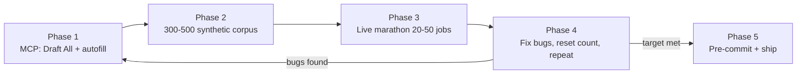

# Job board automation playbook

Step-by-step workflow for shipping a new job board (or hardening an existing one) in AutoCVApply: **Draft All and autofill first**, then **offline corpus**, then **live applications**, then **commit**.

Shipped Auto Apply platforms today: **LinkedIn**, **Indeed**, **Totaljobs**, **Glassdoor**, **Reed**, **SimplyHired**, **CV-Library**. Every new board follows the same five phases.

---

## The five phases (overview)



| Phase | Goal | Exit criteria |
| --- | --- | --- |
| **1. MCP autofill** | Draft All fills real apply steps in your logged-in Chrome | Representative apply page fills without hand-clicking every field |
| **2. Synthetic corpus** | Model search, job detail, apply modal, and field variation offline | 300-500 fixtures generated, validated, smoke fill-verify passes |
| **3. Live marathon** | End-to-end Auto Apply on real jobs | 20-50 confirmed successful applications in one clean run |
| **4. Fix loop** | Patch regressions discovered live | Re-run marathon from **zero count** after each fix until phase 3 passes |
| **5. Commit** | Lock in with CI-equivalent checks | All targeted tests green; `npm run pre-commit:check` passes |

Do **not** skip phase 1 and jump straight to Auto Apply orchestration. Autofill working on the apply DOM is the foundation; navigation and submit logic sit on top.

---

## Prerequisites

### Local stack

```bash
composer run dev          # Laravel + Vite
npm run extension-bridge  # leave running in a second terminal
```

Load unpacked extension from `extension/dist/`. Connect the extension to your dashboard token (`token` + `api_base`).

### Cursor MCP

Add to `.cursor/mcp.json` (adjust `cwd`):

```json
{
  "mcpServers": {
    "autocvapply-extension": {
      "command": "node",
      "args": ["scripts/extension-bridge/mcp-server.mjs"],
      "cwd": "/path/to/autocvapply"
    }
  }
}
```

Restart Cursor. Verify:

```bash
curl -s http://127.0.0.1:7433/status
# "extensionConnected": true
```

Full MCP tool reference: [`scripts/extension-bridge/README.md`](../scripts/extension-bridge/README.md).

### Fast rebuild loop

After every extension edit:

```bash
npm run extension:build-reload
```

This rebuilds `extension/dist/` and reloads the connected unpacked extension without a manual trip to `chrome://extensions`.

---

## Phase 1: Draft All and autofill via MCP

**Problem:** Editing `form-heuristics.js` blind and clicking through Chrome manually is slow. **Solution:** drive your real browser session (cookies, SSO, board login intact) through the extension bridge.

### 1.1 Open a real apply page

1. Log into the job board in Chrome (same profile as the unpacked extension).
2. Navigate to an **Easy Apply / Quick Apply** job and open the application form (modal or full page).
3. In Cursor: `list_tabs` → `set_active_tab` on that tab.

### 1.2 Inspect what the extension sees

| MCP tool | Use for |
| --- | --- |
| `get_field_inventory` | Mechanical field list (refs, types, labels) |
| `read_field_values` | Live DOM values after a fill attempt |
| `read_form_validation` | Client-side validation errors |
| `get_page_html` | Raw HTML when inventory looks wrong |
| `get_debug_logs` | Extension debug phases |

If inventory is empty or missing obvious questions, the DOM uses a pattern generic heuristics do not handle yet (hidden radios, pill buttons, iframes, shadow DOM, comboboxes). Note the widget type before writing code.

### 1.3 Iterate on autofill

```text
get_field_inventory
  → apply_answer (single field) OR start_draft_all (full Draft All)
  → read_field_values + read_form_validation
  → fix form-heuristics.js / field-inventory.js
  → npm run extension:build-reload
  → repeat
```

For multi-step wizards (Indeed-style): `apply_answer` / `start_draft_all` → `click_control` (`Continue`) → `wait_for_tab` → repeat.

### 1.4 Capture fixtures from live pages

When you find a new DOM shape, persist it:

- MCP: `save_fixture` (redacted HTML into `tests/fixtures/form-extraction/html/`)
- Or paste HTML manually, register in `manifest.json`, run `propose-expectations.mjs`

**Capture the right page type:** apply modal / apply-flow markup, not job listings or login walls. See [Oracle pitfall](#oracle-hcm-lessons) below.

### 1.5 Platform tab messages (once `{platform}-auto-apply.js` exists)

After the content-script module exists, use platform-specific MCP tools to call the same handlers the orchestrator uses:

| Platform | MCP tool | Example message types |
| --- | --- | --- |
| LinkedIn | `linkedin_tab_message` | `LINKEDIN_EASY_APPLY_STATE`, `LINKEDIN_FILL_AND_ADVANCE` |
| Indeed | `indeed_tab_message` | `INDEED_APPLY_STATE`, `INDEED_FILL_AND_ADVANCE` |
| Totaljobs | `totaljobs_tab_message` | `TOTALJOBS_APPLY_STATE`, `TOTALJOBS_FILL_AND_ADVANCE` |
| Glassdoor | `glassdoor_tab_message` | `GLASSDOOR_OPEN_APPLY`, `GLASSDOOR_COLLECT_JOB_CARDS` |
| Reed | `reed_tab_message` | `REED_APPLY_STATE`, `REED_FILL_AND_ADVANCE` |

### Phase 1 exit criteria

- [ ] `start_draft_all` fills contact + application questions on at least 3 different live jobs (different employers / field sets).
- [ ] `read_form_validation` shows no blocking errors after fill (or only questions that genuinely need user-specific answers).
- [ ] At least one live HTML capture saved for each distinct apply-step category (e.g. search results, job detail, apply modal, review, success).

### Phase 1 code touchpoints

| Area | Files |
| --- | --- |
| Generic detection | `extension/src/content/form-heuristics.js`, `field-inventory.js` |
| Platform DOM helpers | `extension/src/content/{platform}-auto-apply.js` |
| Corpus mocks | `scripts/form-corpus/lib/mock-answers.mjs` |

---

## Phase 2: Synthetic form corpus (300-500 scenarios)

**Why:** Live jobs are sparse and change often. A generator produces hundreds of variations (roles, companies, locations, field types, optional sections, review steps) so you understand how the board structures forms across many jobs **without** hitting the live site for every regression.

### 2.1 Study live DOM from phase 1

Before writing the generator, list every page category the Auto Apply flow touches:

| Category | Example (Reed) | Example (Totaljobs) |
| --- | --- | --- |
| Search results | `data-qa="job-card"`, easy-apply badge | Quick Apply cards |
| Job detail | Apply button, job metadata | Job view + apply CTA |
| Apply form | Modal `data-qa="apply-job-modal"` | Multi-step wizard |
| Review / confirm | Pre-submit summary | Final review step |
| Success / already applied | "You applied" banner | Confirmation state |

Copy an existing generator as a template:

| Platform | Generator | ID prefix | Count |
| --- | --- | --- | --- |
| Totaljobs | `scripts/form-corpus/generate-totaljobs-corpus-500.mjs` | `syn-tj-500-` | 500 |
| Glassdoor | `scripts/form-corpus/generate-glassdoor-corpus-300.mjs` | `syn-gd-300-` | 300 |
| SimplyHired | `scripts/form-corpus/generate-simplyhired-corpus-300.mjs` | `syn-sh-300-` | 300 |
| Reed | `scripts/form-corpus/generate-reed-corpus-300.mjs` | `syn-reed-300-` | 300 |

Aim for **300-500** scenarios covering all categories above with seeded randomization (roles, companies, optional fields, combobox options).

### 2.2 Generate and register

```bash
# Example: Reed (adjust script name for your platform)
npm run form-corpus:generate-reed-300

# Or manually:
node scripts/form-corpus/generate-{platform}-corpus-300.mjs
node scripts/form-corpus/propose-expectations.mjs --id-prefix=syn-{platform}-300- --force
```

Add a validate script (copy `validate-reed-corpus.mjs`) and an npm script:

```bash
npm run form-corpus:validate-reed-corpus
```

Validation checks: manifest count, HTML + expected JSON exist, minimum field counts per category, `page_url` domain, category distribution.

### 2.3 Vet and fill-verify

```bash
# Spot-check one fixture
node scripts/form-corpus/vet-corpus.mjs --id=syn-reed-300-042
node scripts/form-corpus/run-fill-verify-curated.mjs --id=syn-reed-300-042

# After form-heuristics changes
npm run form-corpus:fill-verify:smoke
npm run form-corpus:build-curated
```

Add platform-specific mock answers in `scripts/form-corpus/lib/mock-answers.mjs` when fill-verify fails on long option lists or ambiguous questions.

### 2.4 Platform unit tests

Add URL builders and parsers (no browser):

```bash
node --test scripts/extension-test/reed-platform.test.mjs
```

### Phase 2 exit criteria

- [ ] 300-500 scenarios in `tests/fixtures/form-extraction/manifest.json` with `status: vetted` (or pending → vetted after review).
- [ ] `npm run form-corpus:validate-{platform}-corpus` passes.
- [ ] `npm run form-corpus:fill-verify:smoke` passes after heuristic changes.
- [ ] Generator categories mirror every apply-step type seen in phase 1 live captures.

---

## Phase 3: Live marathon (20-50 successful applications)

**Goal:** Prove end-to-end Auto Apply on real jobs with your logged-in session.

### 3.1 Wire Auto Apply (if not already)

New platform checklist:

- [ ] `extension/src/shared/{platform}-platform.js` - search URLs, job ID parsing
- [ ] `extension/src/content/{platform}-auto-apply.js` - DOM helpers, step fingerprints, submit verification
- [ ] `extension/src/shared/{platform}-auto-apply-runner.js` - loop driver (if split from content script)
- [ ] `extension/src/shared/auto-apply-orchestrator.js` - platform branch
- [ ] `extension/src/shared/auto-apply-platforms.js` + `resources/js/lib/site.ts` - enabled platform list
- [ ] `extension/manifest.json` - host permissions
- [ ] `scripts/extension-bridge/mcp-server.mjs` - `{platform}_tab_message`, `start_auto_apply` enum
- [ ] `npm run build:extension`

Use **ordered selector fallbacks**, not single selectors. Job boards change class names often.

### 3.2 Run the marathon

**Option A - marathon script (recommended):**

```bash
npm run extension-bridge   # if not already running

node scripts/extension-test/auto-apply-marathon.mjs \
  --platform=reed \
  --target=20 \
  --role="software engineer" \
  --location=London \
  --fit=false
```

Logs: `/tmp/auto-apply-marathon.log`  
Report: `tests/fixtures/form-extraction/auto-apply-marathon-report.json`

**Option B - MCP:**

Call `start_auto_apply` with `platform`, `roleDescription`, `maxApplications`, then poll `auto_apply_status` until done. Use `auto_apply_stop` to bail gracefully.

### 3.3 What counts as success

Only count jobs where submit verification passes (platform-specific):

- Reed: "You applied" on job detail, or apply button gone with confirmation
- LinkedIn: application sent modal / confirmation
- Indeed: step progression to submitted state

Log each `[submitted]` / `Applied to ...` line. The marathon report `totals.applied` should match your manual count.

### 3.4 When the run stalls

Save state for offline debugging:

- MCP `save_fixture` on the stuck tab
- Note step fingerprint / validation errors from `{PLATFORM}_APPLY_STATE` tab messages
- Check `/tmp/auto-apply-marathon.log` for pause reasons (captcha, validation, empty queue)

### Phase 3 exit criteria

- [ ] **20-50** confirmed applications in a **single marathon invocation** without code changes mid-run.
- [ ] No infinite loops (same step fingerprint twice).
- [ ] Search pagination works when the first page exhausts.
- [ ] Already-applied jobs are skipped, not double-submitted.

---

## Phase 4: Fix bugs, reset count, continue

When live testing finds a bug, **do not** count partial progress toward the 20-50 target after you change code.

### Fix loop

```text
1. Reproduce via MCP on the stuck tab (or marathon log line)
2. Fix extension / heuristics / orchestrator
3. npm run extension:build-reload
4. Re-run targeted tests (platform unit test + smoke fill-verify)
5. Restart marathon from --target=20 (or 50) with applied count = 0
6. Repeat until phase 3 exit criteria met
```

```bash
# After a fix - fresh marathon, full target again
node scripts/extension-test/auto-apply-marathon.mjs \
  --platform=reed \
  --target=20 \
  --role="software engineer" \
  --location=London \
  --fit=false
```

### Common live-only bugs (from Reed / Indeed / Totaljobs work)

| Symptom | Typical fix |
| --- | --- |
| False "already submitted" | Tighten submit verification; only confirm when banner/button state matches |
| Modal submit not detected | Broaden modal selectors; drop strict visibility checks on submit button |
| Message channel closed on submit | Fire-and-forget click; verify on page after navigation |
| Post-submit verify on wrong page | Navigate back to job detail before checking confirmation |
| Job collection returns 0 | Trust easy-apply URL filters; read card `data-id`; paginate search |
| Hidden job cards | `unhideJobCardsOnSearch()` or equivalent |
| Draft All hangs on review step | Skip Draft All on review-only steps in orchestrator |

When a live bug reveals a new DOM shape, backport it into the phase 2 generator and add or update synthetic scenarios.

---

## Phase 5: Commit (pre-commit checks)

Run the same checks as CI before committing:

```bash
npm run pre-commit:check
```

Or run individually:

```bash
# Extension / JS changes
npm run format:check
npm run em-dash:check
npm run lint:check:ci

# Platform unit tests
node --test scripts/extension-test/reed-platform.test.mjs

# Form corpus (after form-heuristics / field-inventory changes)
npm run form-corpus:fill-verify:smoke
npm run form-corpus:validate-reed-corpus   # adjust per platform

# PHP changes (if any)
vendor/bin/pint --dirty --format agent
php artisan test --compact --filter=RelevantTest
```

### Pre-commit checklist

- [ ] `npm run extension:build-reload` succeeds
- [ ] Platform unit tests pass
- [ ] `form-corpus:fill-verify:smoke` passes
- [ ] Platform validate script passes (`validate-{platform}-corpus`)
- [ ] `SUPPORTED_PLATFORMS` in `resources/js/lib/site.ts` matches `AUTO_APPLY_PLATFORM_LIST` in `extension/src/shared/auto-apply-platforms.js`
- [ ] Marathon log shows 20-50 clean applications on the final run
- [ ] No secrets in fixtures (`npm run secrets:check-fixtures` if captures added)
- [ ] `npm run pre-commit:check` exit code 0

Only commit when all applicable checks pass. Mention marathon results and corpus counts in the commit message.

---

## Two automation tracks (reference)

| Track | What it does | Primary code | Primary corpus |
| --- | --- | --- | --- |
| **Autofill / Draft All** | Detect fields on an open form and fill from profile. User reviews and submits. | `form-heuristics.js`, `field-inventory.js` | `tests/fixtures/form-extraction/` |
| **Full Auto Apply** | Search jobs, open apply UI, fill each step, advance, submit end-to-end. | `{platform}-auto-apply.js`, `auto-apply-orchestrator.js` | Synthetic `syn-{platform}-*` + live captures |

Phases 1-2 are autofill. Phases 3-4 are Auto Apply. Both must work.

---

## LinkedIn patterns worth copying

These are why LinkedIn Auto Apply is reliable in CI:

1. **Live HTML captures are authoritative** - 212 captures in `tests/fixtures/auto-apply/linkedin/captured/`. Synthetic HTML does not replace real modal shapes.
2. **Capture stuck states** - save HTML when validation fails, step fingerprint repeats, or Next/Review is blocked. Each stuck capture gets a `.diagnose.json` sidecar.
3. **Step fingerprints** - distinguish "still on step 2" from "advanced to review" so the orchestrator does not click Next in a loop.
4. **Dedicated platform module** - modal open/close, primary actions, and confirmation are platform-specific, not generic heuristics.
5. **Verification pyramid** - unit → offline corpus → browser offline → live E2E (manual).

See [`tests/fixtures/auto-apply/linkedin/README.md`](../tests/fixtures/auto-apply/linkedin/README.md).

---

## Oracle HCM lessons

Starting problem: autofill detected almost none of the application questions on a real Oracle Candidate Experience apply flow.

| Lesson | Detail |
| --- | --- |
| **Wrong page type** | Listing fixtures are not apply-flow DOM. Capture the actual apply modal/page. |
| **Hidden radios / pill buttons** | Add platform-specific styled-choice detection (mirror Ashby pattern). |
| **Mock answers** | Corpus fill uses deterministic mocks; add referral/salary mocks in `mock-answers.mjs`. |
| **Clear validation state** | Clear `aria-invalid` / error chrome after successful fills. |
| **Trim fixtures** | Remove `display:none` sections that cause false error-banner failures. |

Fixture reference: `web-oraclecloud-apply-flow-itv` in `tests/fixtures/form-extraction/`.

---

## Pitfalls

| Pitfall | What to do instead |
| --- | --- |
| Skipping MCP autofill iteration | Use bridge tools on live tabs before writing orchestrator logic |
| Single brittle selector | Ordered fallback lists in `{platform}-auto-apply.js` |
| Counting partial marathons after a fix | Restart `--target` from zero after code changes |
| Platform list drift | Keep `site.ts` and `auto-apply-platforms.js` in sync |
| Skipping smoke fill-verify | Always run after `form-heuristics.js` / `field-inventory.js` changes |
| Generator without live grounding | Phase 1 live captures must inform generator categories |

---

## Key files

| Area | Files |
| --- | --- |
| Extension bridge | `scripts/extension-bridge/`, `extension/src/shared/bridge-client.js` |
| Generic field detection | `extension/src/content/form-heuristics.js`, `field-inventory.js` |
| Auto Apply orchestrator | `extension/src/shared/auto-apply-orchestrator.js` |
| Platform registry | `extension/src/shared/auto-apply-platforms.js`, `resources/js/lib/site.ts` |
| Form corpus | `scripts/form-corpus/`, `tests/fixtures/form-extraction/manifest.json` |
| Marathon runner | `scripts/extension-test/auto-apply-marathon.mjs` |
| Curated manifest | `scripts/form-corpus/lib/curated-manifest.mjs` |

---

## Commands quick reference

```bash
# Dev loop
npm run extension-bridge
npm run extension:build-reload

# Phase 2 - generate corpus (examples)
npm run form-corpus:generate-totaljobs-500
npm run form-corpus:generate-glassdoor-300
npm run form-corpus:generate-reed-300
npm run form-corpus:validate-reed-corpus

# Phase 3 - live marathon
node scripts/extension-test/auto-apply-marathon.mjs --platform=reed --target=20 --role="software engineer" --location=London

# Phase 5 - pre-commit
npm run pre-commit:check
npm run form-corpus:fill-verify:smoke
node --test scripts/extension-test/reed-platform.test.mjs
```

---

## Related docs

- [Extension bridge (MCP)](../README.md#extension-bridge-mcp) - setup in root README
- [`scripts/extension-bridge/README.md`](../scripts/extension-bridge/README.md) - full MCP tool list
- [`scripts/form-corpus/README.md`](../scripts/form-corpus/README.md) - fill-verify pyramid
- [`tests/fixtures/auto-apply/linkedin/README.md`](../tests/fixtures/auto-apply/linkedin/README.md) - LinkedIn capture process
